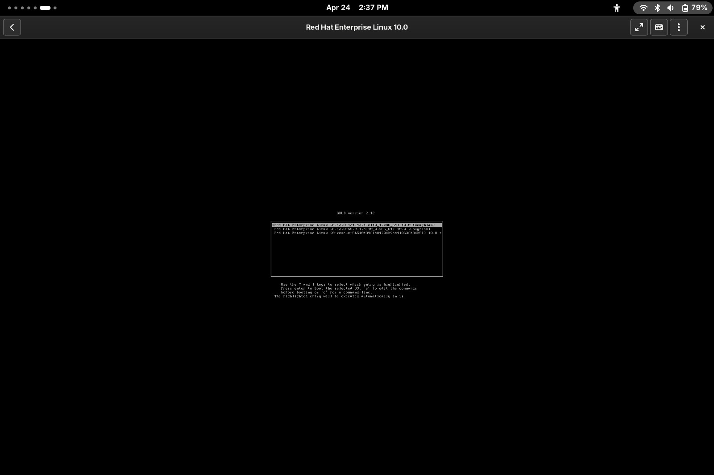
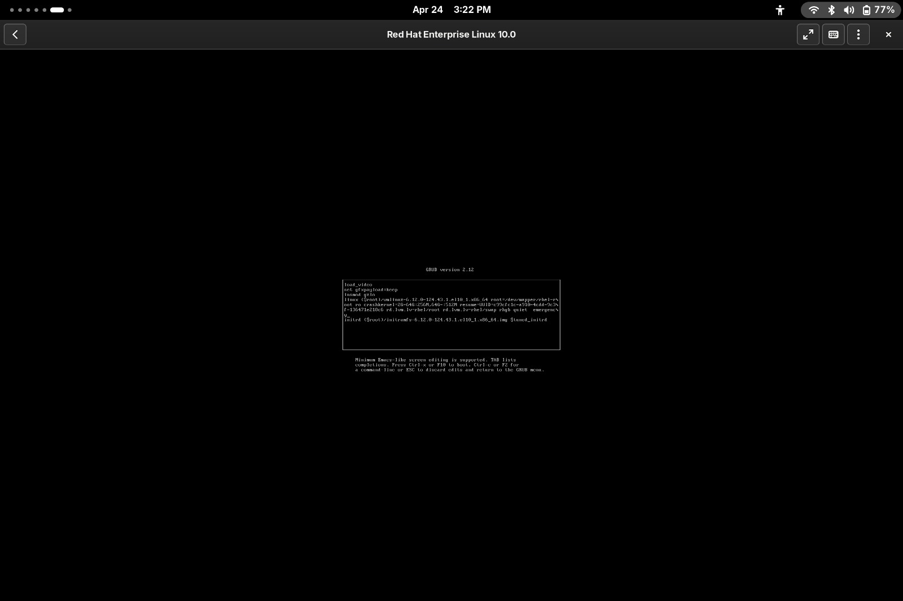
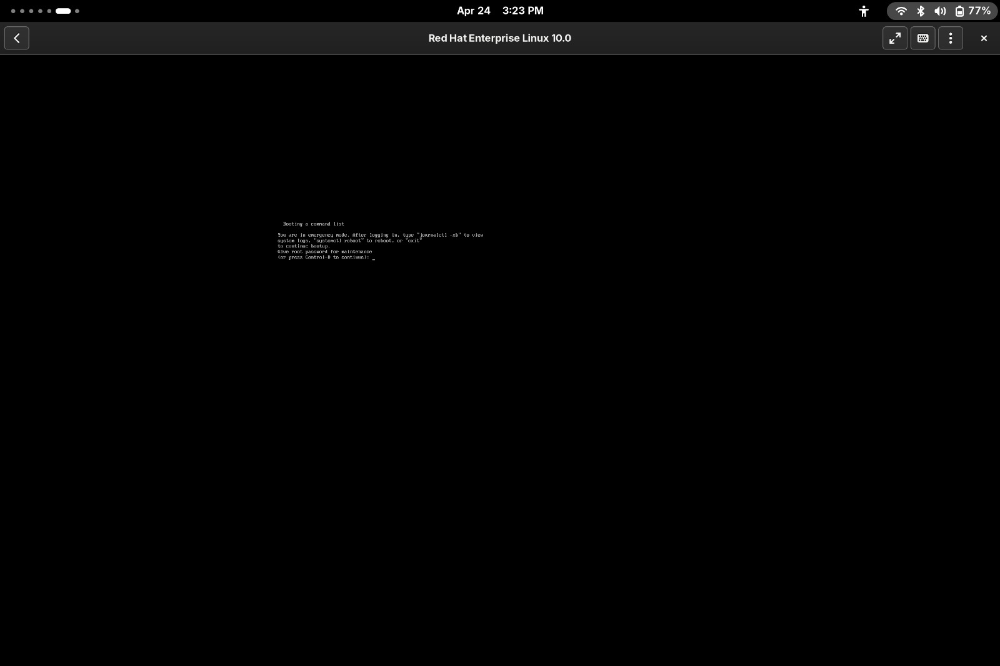
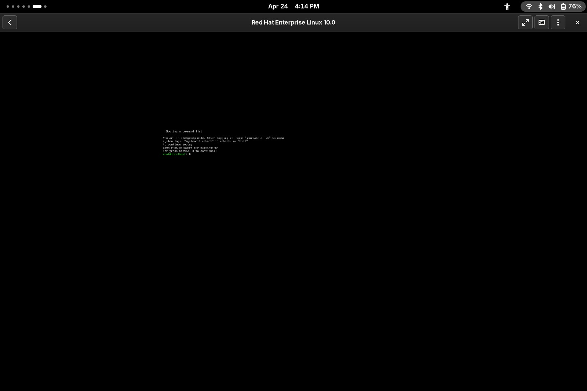
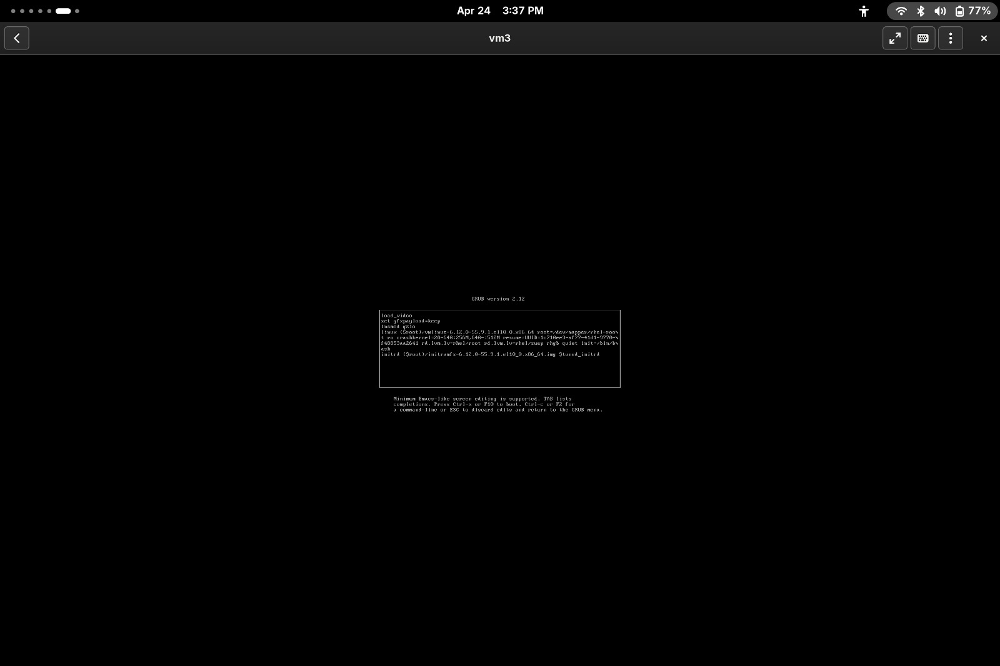
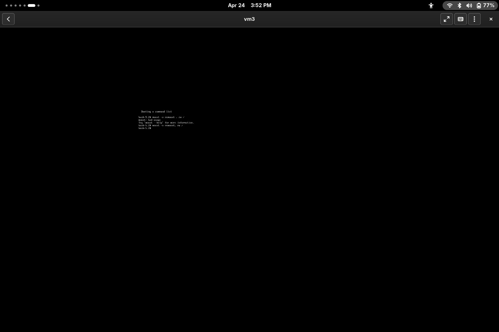
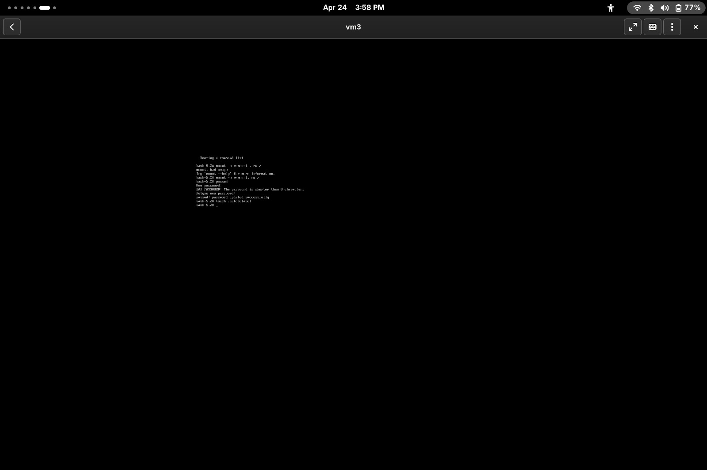
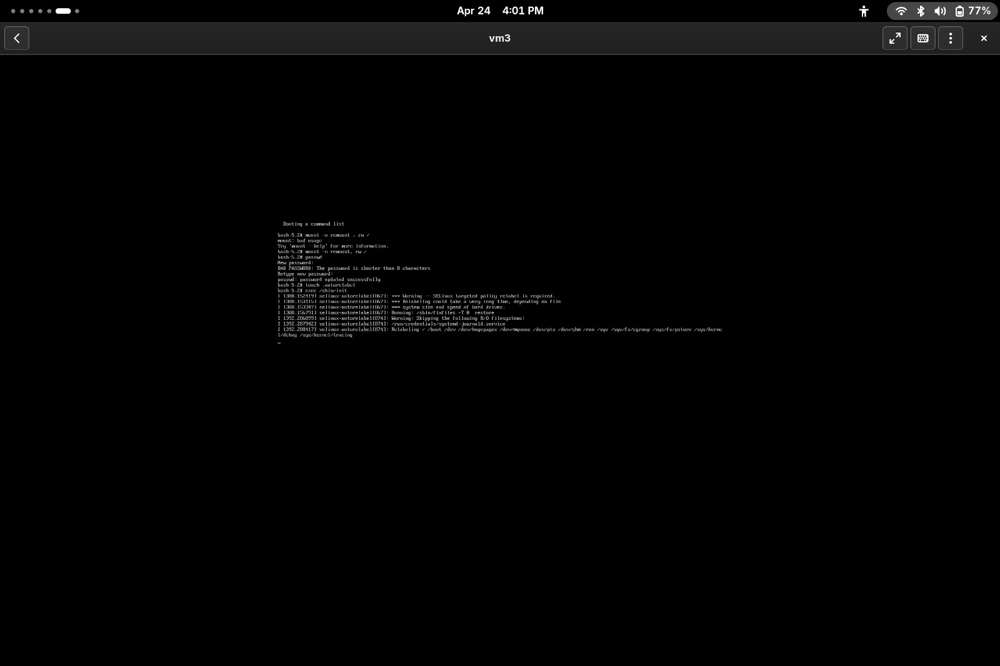

# Boot Process, GRUB2, and System Recovery

**Author:** Usman O. Olanrewaju (Blu3 Sky)

**Date:** 2026/04/24

**Focus:** Linux boot phases, GRUB2 configuration and interaction, boot targets, root password recovery, and broken fstab recovery

---

## Table of Contents

1. [Boot Phases](#1-boot-phases)
2. [Interacting with GRUB2 at Boot Time](#2-interacting-with-grub2-at-boot-time)
3. [Configuring GRUB2](#3-configuring-grub2)
4. [Changing the Boot Timeout](#4-changing-the-boot-timeout)
5. [Booting into a Specific Target](#5-booting-into-a-specific-target)
6. [Recovery — Lost Root Password](#6-recovery--lost-root-password)


--- 


## 1 Booting Phase 
The Linux boot process runs through four sequential phases. Each phase hands control to the next.

```bash
POWER ON  --> BIOS/UEFI --> MBR/GBT --> GRUB/GRUB2 --> KERNEL --> SYSTEMD --> LOGIN
```
### 1.1 Firmware Phase — BIOS & UEFI

**BIOS** (Basic Input and Output System) is the legacy firmware interface. **UEFI** (Unified Extensible Firmware Interface) is the modern, architecture-independent replacement. Both run a **Power-On Self Test (POST)** to verify that hardware is functional before handing off to the bootloader.

To enter the firmware utility, press `F2` or `Del` during system startup (key varies by manufacturer).

### 1.2 Bootloader Phase — GRUB2

**GRUB2** (Grand Unified Bootloader version 2) is the bootloader. Its job is to locate the Linux kernel in the `/boot` filesystem, load it into memory, and transfer control. Loading each piece of code into memory piece by piece is called **bootstrapping**.

Main configuration file: `/boot/grub2/grub.cfg`

### 1.3 Kernel Phase

The kernel is the central program of the operating system — it provides access to hardware and system services. After receiving control from GRUB2, the kernel loads the **initramfs** (initial RAM filesystem) image from `/boot`, executes `/init` inside it, and loads all required driver modules. Once drivers are loaded the kernel mounts the real root filesystem and passes control to systemd.

### 1.4 Initialization Phase — systemd

The final phase. systemd takes control from the kernel and completes system startup. It starts all enabled userspace services and network services and brings the system to the configured **boot target**. A boot target is an operational state defined by a collection of systemd units.

## 2. Interacting with GRUB2 at Boot Time

GRUB2 displays a menu during boot with a default countdown (5 seconds). Before the countdown expires you can interrupt the boot to edit kernel parameters or select a different entry.



**Key bindings at the GRUB2 menu:**

| Key | Action |
|---|---|
| `e` | Open the temporary editor for the selected entry |
| `c` | Drop to the GRUB2 command line |
| `Ctrl+X` | Boot with the current (edited) configuration |
| `Esc` | Discard edits and return to the menu |

In the editor, find the line beginning with `linux` and append the desired boot modifier at the end:

| Modifier | Effect |
|---|---|
| `rescue` | Boot into rescue target (minimal services) |
| `emergency` | Boot into emergency target (root shell, read-only /) |
| `3` | Boot into multi-user target (no GUI) |
| `init=/bin/bash` | Bypass systemd entirely — raw bash shell as PID 1 |

> **Changes made in the GRUB2 temporary editor are not persistent.** They apply to the current boot only. To make permanent changes, edit `/etc/default/grub` and regenerate `grub.cfg` with `grub2-mkconfig`.

## 3. Configuring GRUB2

### 3.1 The Source Configuration File

The human-editable GRUB2 source file is `/etc/default/grub`. This is the file you modify — never edit `/boot/grub2/grub.cfg` directly.
```bash
$ nl  /etc/default/grub 
     1	GRUB_TIMEOUT=5
     2	GRUB_DISTRIBUTOR="$(sed 's, release .*$,,g' /etc/system-release)"
     3	GRUB_DEFAULT=saved
     4	GRUB_DISABLE_SUBMENU=true
     5	GRUB_TERMINAL_OUTPUT="console"
     6	GRUB_CMDLINE_LINUX="crashkernel=2G-64G:256M,64G-:512M resume=UUID=c99cfc1c-a910-4cdd-9c3f-136471e218c6 rd.lvm.lv=rhel/root rd.lvm.lv=rhel/swap rhgb quiet"
     7	GRUB_DISABLE_RECOVERY="true"
     8	GRUB_ENABLE_BLSCFG=true
```
 

**Directive reference:**

| Directive | Description |
|---|---|
| `GRUB_TIMEOUT` | Wait time in seconds before booting the default entry. Default is 5. |
| `GRUB_DISTRIBUTOR` | Sets the name of the Linux distribution shown in the boot menu. |
| `GRUB_DEFAULT` | Sets the default boot entry. `saved` boots the last-selected entry; `0` boots the first entry. |
| `GRUB_DISABLE_SUBMENU` | Enables or disables GRUB2 submenu display. |
| `GRUB_TERMINAL_OUTPUT` | Sets the default terminal output device. |
| `GRUB_CMDLINE_LINUX` | Specifies command-line options passed to the kernel at boot. |
| `GRUB_DISABLE_RECOVERY` | Shows or hides system recovery menu entries. |
| `GRUB_ENABLE_BLSCFG` | Enables or disables BootLoader Specification (BLS) format. |

### 3.2 The Source Script Directory

`/etc/grub.d/` contains executable shell scripts that `grub2-mkconfig` runs in sort order to generate sections of `grub.cfg`. You generally do not need to edit these directly.

```bash 
$ sudo ls -l /etc/grub.d/
[sudo] password for blu3sky: 
total 112
-rwxr-xr-x. 1 root root  9380 Mar 24  2025 00_header
-rwxr-xr-x. 1 root root  1100 Feb  3  2025 00_tuned
-rwxr-xr-x. 1 root root   236 Mar 24  2025 01_users
-rwxr-xr-x. 1 root root   835 Mar 24  2025 08_fallback_counting
-rwxr-xr-x. 1 root root 20334 Mar 24  2025 10_linux
-rwxr-xr-x. 1 root root   833 Mar 24  2025 10_reset_boot_success
-rwxr-xr-x. 1 root root   892 Mar 24  2025 12_menu_auto_hide
-rwxr-xr-x. 1 root root   410 Mar 24  2025 14_menu_show_once
-rwxr-xr-x. 1 root root 14627 Mar 24  2025 20_linux_xen
-rwxr-xr-x. 1 root root  2562 Mar 24  2025 20_ppc_terminfo
-rwxr-xr-x. 1 root root   869 Mar 24  2025 25_bli
-rwxr-xr-x. 1 root root 11006 Mar 24  2025 30_os-prober
-rwxr-xr-x. 1 root root  1166 Mar 24  2025 30_uefi-firmware
-rwxr-xr-x. 1 root root   725 Dec 15  2024 35_fwupd
-rwxr-xr-x. 1 root root   218 Mar 24  2025 40_custom
-rwxr-xr-x. 1 root root   219 Mar 24  2025 41_custom
-rw-r--r--. 1 root root   483 Mar 24  2025 README
```


### 3.3 The Persistent GRUB2 Environment File

`/boot/grub2/grubenv` stores persistent GRUB2 environment variables. The `saved_entry` variable is used by `GRUB_DEFAULT=saved` to remember the last-booted menu entry across reboots.

```bash 
$ sudo cat /boot/grub2/grubenv
# GRUB Environment Block
# WARNING: Do not edit this file by tools other than grub-editenv!!!
saved_entry=5b510439f1e0470db9ce41063fb8db5f-6.12.0-124.43.1.el10_1.x86_64
menu_auto_hide=1
boot_success=1
boot_indeterminate=0
##################################################################################################################################################################################################################################################################################################################################################################################################################################################################################################################################################################################################################################################################################################################################################################################################################################
``` 

> **Never edit `/boot/grub2/grubenv` manually.** Use `grub2-editenv` if you need to modify environment variables programmatically.

## 4. Changing the Boot Timeout

### 4.1 Edit the source file

Change `GRUB_TIMEOUT` in `/etc/default/grub`:

```bash 
$ nl  /etc/default/grub 
     1	GRUB_TIMEOUT=10
     2	GRUB_DISTRIBUTOR="$(sed 's, release .*$,,g' /etc/system-release)"
     3	GRUB_DEFAULT=saved
     4	GRUB_DISABLE_SUBMENU=true
     5	GRUB_TERMINAL_OUTPUT="console"
     6	GRUB_CMDLINE_LINUX="crashkernel=2G-64G:256M,64G-:512M resume=UUID=c99cfc1c-a910-4cdd-9c3f-136471e218c6 rd.lvm.lv=rhel/root rd.lvm.lv=rhel/swap rhgb quiet"
     7	GRUB_DISABLE_RECOVERY="true"
     8	GRUB_ENABLE_BLSCFG=true
```

### 4.2 Regenerate grub.cfg

After editing `/etc/default/grub`, always regenerate the actual configuration file:

```bash 
$ sudo grub2-mkconfig -o /boot/grub2/grub.cfg 
Generating grub configuration file ...
Adding boot menu entry for UEFI Firmware Settings ...
done
```
> **Always run `grub2-mkconfig` after modifying `/etc/default/grub`.** Changes to the source file have no effect until `grub.cfg` is regenerated.

## 5.Booting into a Specific Target

At the GRUB2 menu press `e` to open the editor. Find the line beginning with `linux` and append the target to the end of that line.
### 5.1 Emergency target

Append `systemd.unit=emergency.target` to the `linux` line.



Press `Ctrl+X` to boot. The system drops to a root shell with the filesystem mounted read-only. Enter the root password when prompted.







## 6. Recovery — Lost Root Password

Use this procedure when the root password is unknown or a broken `/etc/fstab` is preventing boot.

### 6.1 Enter the GRUB2 editor

At the GRUB2 menu press `e`. Find the `linux` line and append:

```
init=/bin/bash
```


Press `Ctrl+X` to boot. The system starts a bare bash shell as PID 1, bypassing systemd entirely. No services start. No password is required.

### 6.2 Remount root filesystem read-write

The root filesystem mounts read-only by default in this mode. Remount it writable before making any changes:

```bash
mount -o remount,rw /
```



### 6.3 Reset the root password

```bash
passwd root
```

Enter and confirm the new password.

### 6.4 Create the SELinux relabel file

The `passwd` command modifies `/etc/shadow`. SELinux tracks file security contexts — since `/etc/shadow` was modified outside a normal boot, SELinux needs to relabel it before the next boot. Create the trigger file:

```bash
touch /.autorelabel
```



### 6.5 Hand control back to systemd

```bash
exec /sbin/init
```

This replaces the current bash process (PID 1) with systemd. The system continues booting normally, and SELinux performs the relabeling pass before login becomes available.



> **Broken fstab recovery uses the same procedure.** Remount read-write, edit `/etc/fstab` to fix or remove the bad entries, then reboot with `reboot -f`. The `/.autorelabel` file is only needed if you modified security-sensitive files like `/etc/shadow`.

## Key Concepts and Common Mistakes

### Never edit grub.cfg directly

`/boot/grub2/grub.cfg` is auto-generated. Any manual edits will be overwritten the next time `grub2-mkconfig` runs. Always edit `/etc/default/grub` and regenerate.

### GRUB2 editor changes are temporary

Modifications made at the GRUB2 `e` editor apply to the current boot only. They are not saved anywhere. For permanent changes, use the source file and `grub2-mkconfig`.

### init=/bin/bash bypasses everything

No systemd, no services, no network, no SELinux enforcement. The shell runs as root with no authentication. This is why physical access to a machine is equivalent to root access unless disk encryption is in place.

### Always create /.autorelabel after out-of-band shadow modification

If you reset the root password using `init=/bin/bash`, the `/etc/shadow` file gets a new SELinux context that does not match what the policy expects. Without `/.autorelabel`, SELinux will deny access to the file and login will fail even with the correct password.

### Broken fstab — use nofail on lab entries

Any fstab entry pointing to a device that is not present at boot will hang the system indefinitely. Always add `nofail` to lab or removable device entries so the system continues booting even if the device is absent.

