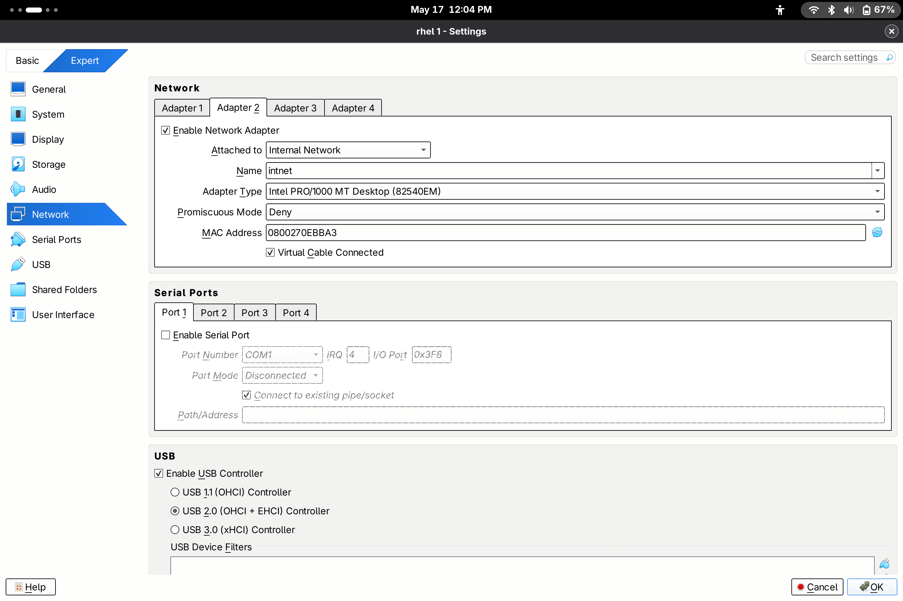

# Network Management

**Author:** Usman O. Olanrewaju (Blu3 Sky)

**Created:** 2026-05-14

**Modified:** 2026-05-17  

**Focus:** Hostname management, network protocols, IPv4/IPv6, IP addressing (classful, subnetting, CIDR), NetworkManager tools, connection profiles, host table, and two-machine local networking

---

## Table of Contents

1. [Core Networking Concepts](#1-core-networking-concepts)
2. [Hostname Management](#2-hostname-management)
3. [Protocols, Ports, and Layer Fundamentals](#3-protocols-ports-and-layer-fundamentals)
4. [IP Addressing — Classful, Subnetting, and CIDR](#4-ip-addressing--classful-subnetting-and-cidr)
5. [Adding a Network Interface](#5-adding-a-network-interface)
6. [NetworkManager and Connection Profiles](#6-networkmanager-and-connection-profiles)
7. [Connecting Two Machines Locally via the Host Table](#7-connecting-two-machines-locally-via-the-host-table)
8. [Verifying from the First Machine](#8-verifying-from-the-first-machine)
9. [Teardown](#9-teardown)

---

## 1. Core Networking Concepts

**Hostname** — A unique label assigned to a node to identify it on the network. Up to 63 alphanumeric characters including letters, digits, and hyphens.

**Protocol** — A set of rules governing the exchange of data between two network nodes. Defines how data is formatted, coded, and controlled. A protocol is an agreement between two parties on how communication is to proceed.

**Network Interface** — The hardware or virtual device through which a machine connects to a network. Identified by names such as `enp1s0`, `enp0s3`, or `lo` (loopback).

**Connection Profile** — A configuration file managed by NetworkManager that defines how a network interface should behave — its IP address, gateway, DNS, autoconnect behavior, and more.


## 2. Hostname Management

### 2.1 Check the current hostname 
```bash 
$ hostname
usman.door.com
``` 

### 2.2 Change the hostname with hostnamectl 
```bash
$ hostnamectl hostname Sky.Usman.com 
```
### 2.3 Reload the hostname daemon
```bash
$ sudo systemctl restart systemd-hostnamed
```

### 2.4 Verify the full system identity
```bash 
$ hostnamectl
 Static hostname: Sky.Usman.com
       Icon name: computer-vm
         Chassis: vm 🖴
      Machine ID: 5b510439f1e0470db9ce41063fb8db5f
         Boot ID: 74861ff61b17410bbcb92ab3d926e5a2
    AF_VSOCK CID: 1
  Virtualization: kvm
Operating System: Red Hat Enterprise Linux 10.0 (Coughlan) 
     CPE OS Name: cpe:/o:redhat:enterprise_linux:10::baseos
          Kernel: Linux 6.19.14-300.fc44.x86_64
    Architecture: x86-64
 Hardware Vendor: QEMU
  Hardware Model: Standard PC _Q35 + ICH9, 2009_
Firmware Version: 1.17.0-9.fc43
   Firmware Date: Tue 2025-06-10
    Firmware Age: 11month 6d
```
> To see the new hostname reflected in your shell prompt, exit the terminal and reopen it — or run `exec bash`.
 

### 2.5 Alternative methods for changing the hostname

**Edit the hostname file directly:**
```bash 
$ sudo vi   /etc/hostname
```
**Using nmcli:**

```bash
$ sudo nmcli general hostname Usman.Sky.sittig 
```
  
```bash 
$ hostname
Usman.Sky.sittig
``` 

> `hostnamectl`, `nmcli general hostname`, `hostnamectl set-hostname`, and editing `/etc/hostname` directly all work. Pick one and stay consistent.


## 3. Protocols, Ports, and Layer Fundamentals
 
A protocol is a set of rules governing the exchange of data between two network nodes. These rules include how data is formatted, coded, and controlled. protocol is an agreement bewteen two community on how communication is to proceeds 

### 3.1 Protocol list — /etc/protocols 
```bash 
$ cat /etc/protocols  |  head -25 
# /etc/protocols:
# $Id: protocols,v 1.12 2016/07/08 12:27 ovasik Exp $
#
# Internet (IP) protocols
#
#	from: @(#)protocols	5.1 (Berkeley) 4/17/89
#
# Updated for NetBSD based on RFC 1340, Assigned Numbers (July 1992).
# Last IANA update included dated 2011-05-03
#
# See also http://www.iana.org/assignments/protocol-numbers

ip	0	IP		# internet protocol, pseudo protocol number
hopopt	0	HOPOPT		# hop-by-hop options for ipv6
icmp	1	ICMP		# internet control message protocol
igmp	2	IGMP		# internet group management protocol
ggp	3	GGP		# gateway-gateway protocol
ipv4	4	IPv4		# IPv4 encapsulation
st	5	ST		# ST datagram mode
tcp	6	TCP		# transmission control protocol
cbt	7	CBT		# CBT, Tony Ballardie <A.Ballardie@cs.ucl.ac.uk>
egp	8	EGP		# exterior gateway protocol
igp	9	IGP		# any private interior gateway (Cisco: for IGRP)
bbn-rcc	10	BBN-RCC-MON		# BBN RCC Monitoring
nvp	11	NVP-II		# Network Voice Protocol

#truncated output 
```
### 3.2 Well-known ports — /etc/services
TCP (Transmission Control Protocol) is reliable, connection-oriented, and point-to-point. UDP (User Datagram Protocol) is unreliable and connectionless. Both are transport-layer protocols responsible for carrying data between nodes.

```bash 
$ cat /etc/services | head -25
# /etc/services:
# $Id: services,v 1.49 2017/08/18 12:43:23 ovasik Exp $
#
# Network services, Internet style
# IANA services version: last updated 2021-01-19
#
# Note that it is presently the policy of IANA to assign a single well-known
# port number for both TCP and UDP; hence, most entries here have two entries
# even if the protocol doesn't support UDP operations.
# Updated from RFC 1700, ``Assigned Numbers'' (October 1994).  Not all ports
# are included, only the more common ones.
#
# The latest IANA port assignments can be gotten from
#       http://www.iana.org/assignments/port-numbers
# The Well Known Ports are those from 0 through 1023.
# The Registered Ports are those from 1024 through 49151
# The Dynamic and/or Private Ports are those from 49152 through 65535
#
# Each line describes one service, and is of the form:
#
# service-name  port/protocol  [aliases ...]   [# comment]

tcpmux          1/tcp                           # TCP port service multiplexer
tcpmux          1/udp                           # TCP port service multiplexer
rje             5/tcp                           # Remote Job Entry
```

### 3.3 ICMP — connectivity testing

ICMP (Internet Control Message Protocol) is used primarily for testing and diagnosing network connections.

#### 3.3.1 Checking google  Connectivity 
```bash 
$ ping google.com  -c5
PING google.com (142.251.208.110) 56(84) bytes of data.
64 bytes from lcsofb-ae-in-f14.1e100.net (142.251.208.110): icmp_seq=1 ttl=118 time=17.7 ms
64 bytes from lcsofb-ae-in-f14.1e100.net (142.251.208.110): icmp_seq=2 ttl=118 time=34.2 ms
64 bytes from lcsofb-ae-in-f14.1e100.net (142.251.208.110): icmp_seq=3 ttl=118 time=19.3 ms
64 bytes from lcsofb-ae-in-f14.1e100.net (142.251.208.110): icmp_seq=4 ttl=118 time=15.2 ms
64 bytes from lcsofb-ae-in-f14.1e100.net (142.251.208.110): icmp_seq=5 ttl=118 time=18.7 ms

--- google.com ping statistics ---
5 packets transmitted, 5 received, 0% packet loss, time 4005ms
rtt min/avg/max/mdev = 15.150/20.993/34.172/6.738 ms
```

### 3.4 Ethernet — MAC address
The Ethernet address (also called hardware address, physical address, link layer address, or MAC address) is a unique 48-bit identifier used to route packets to the correct destination at the data-link layer.
```bash
$ ip a | grep ether
    link/ether 52:54:00:df:6d:52 brd ff:ff:ff:ff:ff:ff
```

### 3.5 Internet Protocol

Every device on a network requires a unique identifier — provided by an IP address. Two versions are in active use today.

#### 3.5.1 IPv4
IPv4 is a 32-bit logical address expressed in dotted-decimal notation (e.g. `192.168.122.88`). It was the first IP version released for public use.

```bash
$ ip addr 
1: lo: <LOOPBACK,UP,LOWER_UP> mtu 65536 qdisc noqueue state UNKNOWN group default qlen 1000
    link/loopback 00:00:00:00:00:00 brd 00:00:00:00:00:00
    inet 127.0.0.1/8 scope host lo   # --> LOOPBACK RESERVED FOR MACHINE 
       valid_lft forever preferred_lft forever
    inet6 ::1/128 scope host noprefixroute 
       valid_lft forever preferred_lft forever
2: enp1s0: <BROADCAST,MULTICAST,UP,LOWER_UP> mtu 1500 qdisc fq_codel state UP group default qlen 1000
    link/ether 52:54:00:df:6d:52 brd ff:ff:ff:ff:ff:ff
    altname enx525400df6d52
    inet 192.168.122.88/24 brd 192.168.122.255 scope global dynamic noprefixroute enp1s0    #  -->  IPV4
       valid_lft 2327sec preferred_lft 2327sec
    inet6 fe80::5054:ff:fedf:6d52/64 scope link noprefixroute                # -->  IPV6
       valid_lft forever preferred_lft forever

``` 

### 3.5.2 IPv6 (Internet Protocol version 6) 
IPv6 is a 128-bit address expressed in colon-separated hexadecimal groups (e.g. `fe80::5054:ff:fedf:6d52`). It replaces IPv4 to meet the exhaustion of the 4.3 billion IPv4 address space.

```bash
$ ip addr  |  grep inet6
    inet6 ::1/128 scope host noprefixroute 
    inet6 fe80::5054:ff:fedf:6d52/64 scope link noprefixroute 

```
**IPv4 vs IPv6 comparison:**

| Feature | IPv4 | IPv6 |
|---|---|---|
| Address format | 4×8-bit, period-separated decimal | 8×16-bit, colon-separated hexadecimal |
| Example | `192.168.0.100` | `fe80::a00:27ff:feae:f35b` |
| Address bits | 32 | 128 |
| Max addresses | ~4.3 billion | Virtually unlimited |
| Autoconfiguration | Limited — manual or DHCP | Yes — via SLAAC |
| Minimum packet size | 576 bytes | 1280 bytes |
| Built-in IPsec | Optional | Optional and standardized |
| Common testing tools | ping, traceroute, tracepath | Same tools — auto-detect IP version |

> The `127.0.0.0/8` range is reserved for loopback testing and cannot be assigned to nodes.

## 4. IP Addressing — Classful, Subnetting, and CIDR

### 4.1 Classful Addressing — The Historical Foundation

The original IPv4 address space was divided into five classes (A, B, C, D, and E) to accommodate networks of varying sizes. Classes A, B, and C were used for general network assignments. Class D was reserved for multicasting. Class E was set aside for experimental use.

Each address consisted of two parts: the **network** portion, which identified the destination network, and the **node** (or host) portion, which identified a specific device on that network. The key characteristic of classful addressing was the **fixed boundary** between the network and node portions.

| Class | Address Range | Default Mask | Max Networks | Max Hosts per Network | Typical Network Size |
|---|---|---|---|---|---|
| A | 1.0.0.0 – 126.255.255.255 | 255.0.0.0 | 126 | ~16 million | Large |
| B | 128.0.0.0 – 191.255.255.255 | 255.255.0.0 | 16,384 | 65,534 | Medium |
| C | 192.0.0.0 – 223.255.255.255 | 255.255.255.0 | ~2 million | 254 | Small |

> The rigid fixed boundaries of classful addressing caused significant inefficiency and rapid IPv4 address exhaustion. A large organization might receive a full Class A block and use only a fraction of it, while a growing organization could outgrow a Class C block that only supported 254 nodes.

### 4.2 Subnetting and the Subnet Mask

**Subnetting** is the process of dividing a large network address space into multiple smaller, logical subnetworks called **subnets**. It reduces network congestion, improves performance, and simplifies administration.

Technically, subnetting borrows bits from the node portion of the address to create additional network identifiers. The original network bits remain unchanged.

**Key rules of subnetting:**

- Subnetting reduces the number of usable node addresses per subnet.
- All devices within a subnet share the same subnet mask.
- Each subnet functions as an independent network and requires a router to communicate with other subnets.
- The **first** address in a subnet identifies the subnet itself (network address).
- The **last** address in a subnet is the broadcast address.
- Neither the first nor the last address can be assigned to a node.
A **subnet mask** (or netmask) defines which bits of an IP address represent the network and which represent the node. Routers use the mask to distinguish the boundary between network and node portions.

The `1`s in the mask represent network bits. The `0`s represent node bits. Like IP addresses, subnet masks can be written in binary or dotted-decimal notation.

**Example — Class C subnet:**

```
IP Address:  192.168.1.10
Subnet Mask: 255.255.255.0
             11111111.11111111.11111111.00000000

Network:     192.168.1.0       (first 24 bits)
Broadcast:   192.168.1.255     (last address)
Usable range: 192.168.1.1 – 192.168.1.254  (254 hosts)
```

### 4.3 CIDR — Classless Inter-Domain Routing

**CIDR** (Classless Inter-Domain Routing) replaced classful addressing to prevent the rapid depletion of IPv4 addresses and reduce the size of global routing tables. CIDR eliminates the fixed class boundaries (8, 16, or 24 bits) and allows the network/node division to occur at any bit in the 32-bit address. This enables variable-size block allocation — improving efficiency and scalability.

CIDR notation expresses an IP address and its subnet mask compactly using a trailing slash followed by the number of bits in the network portion — called the **prefix length**.

```
192.168.1.10/24   =   IP 192.168.1.10  with subnet mask 255.255.255.0
10.0.0.1/8        =   IP 10.0.0.1      with subnet mask 255.0.0.0
172.16.5.1/16     =   IP 172.16.5.1    with subnet mask 255.255.0.0
```

**CIDR prefix reference:**

| Prefix | Subnet Mask | Usable Hosts |
|---|---|---|
| /8 | 255.0.0.0 | 16,777,214 |
| /16 | 255.255.0.0 | 65,534 |
| /24 | 255.255.255.0 | 254 |
| /25 | 255.255.255.128 | 126 |
| /26 | 255.255.255.192 | 62 |
| /27 | 255.255.255.224 | 30 |
| /28 | 255.255.255.240 | 14 |
| /30 | 255.255.255.252 | 2 |

> `/24` is the most common prefix in lab environments. Every IP address shown in this document with `/24` means the first 24 bits are the network and the last 8 bits are the node — giving 254 usable host addresses on that subnet.


## 5. Adding a Network Interface

> This section uses Oracle VirtualBox. The steps differ from GNOME Boxes.

### 5.1 VirtualBox VM network setup

- Open VM Settings → click **Expert**
- Scroll to **Network**
- Click on an available adapter slot
- Check **Enable Network Adapter**
- Set **Attached to:** Internal Network




### 4.2 Verify the new interface appeared

```bash
$ ip a
1: lo: <LOOPBACK,UP,LOWER_UP> mtu 65536 qdisc noqueue state UNKNOWN group default qlen 1000
    link/loopback 00:00:00:00:00:00 brd 00:00:00:00:00:00
    inet 127.0.0.1/8 scope host lo
       valid_lft forever preferred_lft forever
    inet6 ::1/128 scope host noprefixroute 
       valid_lft forever preferred_lft forever
2: enp0s3: <BROADCAST,MULTICAST,UP,LOWER_UP> mtu 1500 qdisc fq_codel state UP group default qlen 1000
    link/ether 08:00:27:a2:74:6d brd ff:ff:ff:ff:ff:ff
    altname enx080027a2746d
    inet 192.168.92.241/21 brd 192.168.95.255 scope global dynamic noprefixroute enp0s3
       valid_lft 603875sec preferred_lft 603875sec
    inet6 fe80::a00:27ff:fea2:746d/64 scope link noprefixroute 
       valid_lft forever preferred_lft forever
3: enp0s8: <BROADCAST,MULTICAST,UP,LOWER_UP> mtu 1500 qdisc fq_codel state UP group default qlen 1000   # --> the new attached interface 
    link/ether 08:00:27:94:0d:4c brd ff:ff:ff:ff:ff:ff
    altname enx080027940d4c
``` 


## 6. NetworkManager and Connection Profiles

NetworkManager is the system service that manages network connections on RHEL and Fedora. It stores connection profiles as files under `/etc/NetworkManager/system-connections/`.

**Network management tools:**

| Command | Description |
|---|---|
| `ip` | Displays, monitors, and manages interfaces, connections, routing, and traffic |
| `nmcli` | Creates, updates, deletes, activates, and deactivates connection profiles and manages devices |
| `nmtui` | Text-based equivalent of `nmcli` — interactive menu interface |
| `nm-connection-editor` | Graphical tool for managing network devices and connections |

> `ifup`, `ifdown`, and `ifconfig` are deprecated and should no longer be used. NetworkManager and its tools are the replacements.

**Connection profile key directives:**

| Property | Description |
|---|---|
| `id` | Human-readable name for the connection. Defaults to the interface name. |
| `uuid` | UUID associated with this connection |
| `type` | Specifies the connection type (ethernet, wifi, etc.) |
| `autoconnect-priority` | Priority when multiple connections are available. Range: -999 to 999. Higher = preferred. Default: 0. |
| `interface_name` | The device name for the network interface |
| `timestamp` | Unix epoch time of last successful activation — auto-populated |
| `address1/method` | Static IP for the connection when method is set to manual. `/24` represents the subnet mask. |
| `addr-gen-mode` | Generates an IPv6 address based on the hardware address of the interface |

> Run `man nm-settings` for a full description of all available connection profile properties.

### 6.1 Intial  connection status 
```bash
$ nmcli connection show
NAME    UUID                                  TYPE      DEVICE 
enp0s3  1e5994f8-54d9-3eb0-946f-5d9fd95c799f  ethernet  enp0s3  # --> the device made during installation
lo      f491aa6d-e328-4245-aa1a-0581d19824eb  loopback  lo     # --> same at this and this is for loopback
```

### 6.2 Check all Devices Available 
```bash 
$ nmcli d
DEVICE  TYPE      STATE                   CONNECTION 
enp0s3  ethernet  connected               enp0s3     
lo      loopback  connected (externally)  lo         
enp0s8  ethernet  disconnected            --         # --> this is our own and not yet connected 
```
### 6.3 Check Configuration of Intial connected interface 
```bash
$ sudo cat /etc/NetworkManager/system-connections/enp0s3.nmconnection 
[sudo] password for blue: 
[connection]
id=enp0s3
uuid=1e5994f8-54d9-3eb0-946f-5d9fd95c799f
type=ethernet
autoconnect-priority=-999
interface-name=enp0s3
timestamp=1778961649

[ethernet]

[ipv4]
method=auto

[ipv6]
addr-gen-mode=eui64
method=auto

[proxy]
``` 

### 6.4 Create a connection profile
```bash 
$ sudo nmcli c a type ethernet ifname en0ps8 con-name usman ip4 192.168.10.230/24 gw4 192.168.10.1 ipv4.dns 192.168.10.1
Connection 'usman' (22f3037d-170c-4611-9220-2cfd3b59cf5a) successfully added.
```
### 6.5  Verify the profile was created 
```bash 
$ nmcli connection show 
NAME    UUID                                  TYPE      DEVICE 
enp0s3  1e5994f8-54d9-3eb0-946f-5d9fd95c799f  ethernet  enp0s3 
lo      f491aa6d-e328-4245-aa1a-0581d19824eb  loopback  lo     
usman   22f3037d-170c-4611-9220-2cfd3b59cf5a  ethernet  --   
```

### 6.6  Check Configuration 

```bash 
$ sudo cat /etc/NetworkManager/system-connections/usman.nmconnection 
[connection]
id=usman
uuid=22f3037d-170c-4611-9220-2cfd3b59cf5a
type=ethernet
interface-name=en0ps8

[ethernet]

[ipv4]
address1=192.168.10.230/24
dns=192.168.10.1;
gateway=192.168.10.1
method=manual

[ipv6]
addr-gen-mode=default
method=auto

[proxy]
```

### 6.7  Error Connection 
```bash
$ sudo nmcli connection up usman
[sudo] password for blue: 
Error: Connection activation failed: No suitable device found for this connection (device enp0s3 not available because profile is not compatible with device (mismatching interface name)).
```
### 6.8 Modify the interface name 
```bash 
$ sudo nmcli connection modify usman ifname enp0s8 
```
### 6.9  Check Configuration 
```bash 
$ sudo cat /etc/NetworkManager/system-connections/usman.nmconnection 
[connection]
id=usman
uuid=22f3037d-170c-4611-9220-2cfd3b59cf5a
type=ethernet
interface-name=enp0s8

[ethernet]

[ipv4]
address1=192.168.10.230/24
dns=192.168.10.1;
gateway=192.168.10.1
method=manual

[ipv6]
addr-gen-mode=default
method=auto

[proxy]
```
### 6.10 Activate the connection

```bash
$ sudo nmcli connection up usman
Connection successfully activated (D-Bus active path: /org/freedesktop/NetworkManager/ActiveConnection/4)
```

### 6.11 Verify connection status and active 
```bash 
$ sudo nmcli connection show
NAME    UUID                                  TYPE      DEVICE 
enp0s3  1e5994f8-54d9-3eb0-946f-5d9fd95c799f  ethernet  enp0s3 
usman   22f3037d-170c-4611-9220-2cfd3b59cf5a  ethernet  enp0s8 
lo      f491aa6d-e328-4245-aa1a-0581d19824eb  loopback  lo  
```


### 6.12  Turn off the connection
```bash 
$ sudo nmcli d down enp0s8 
Device 'enp0s8' successfully disconnected.
```
### 6.13 Verify disconnected 
```bash 
$ sudo nmcli connection show
NAME    UUID                                  TYPE      DEVICE 
enp0s3  1e5994f8-54d9-3eb0-946f-5d9fd95c799f  ethernet  enp0s3 
lo      f491aa6d-e328-4245-aa1a-0581d19824eb  loopback  lo     
usman   22f3037d-170c-4611-9220-2cfd3b59cf5a  ethernet  --  
```
> This connection is local to the machine — not reachable from the internet.


## 7. Connecting Two Machines Locally via the Host Table

The `/etc/hosts` file provides static hostname-to-IP resolution without DNS. It is read before DNS on most systems and is the simplest way to enable hostname-based communication between machines on a local network.

### 7.1 Set up the second machine

Create a new machine --> Add the adapter --> turn on --> verify the new ifname --> then create a connection profile:
 (ip 192.168.10.240/24 , dns 192.168.10.1 ,gateway=192.168.10.1, con-name usman1 ) 

```bash
$ sudo nmcli c  a type ethernet ifname enp0s8 con-name usman1 ip4 192.168.10.240/24 gw4 192.168.10.1 ipv4.dns 192.168.10.1
Connection 'usman1' (cb812fa6-7fe7-46af-b188-1c5d608c6997) successfully added.
```


### 7.2 Verify interface on the second machine
```bash 
$ ip a | grep enp
2: enp0s3: <BROADCAST,MULTICAST,UP,LOWER_UP> mtu 1500 qdisc fq_codel state UP group default qlen 1000
    inet 192.168.94.47/21 brd 192.168.95.255 scope global dynamic noprefixroute enp0s3
3: enp0s8: <BROADCAST,MULTICAST,UP,LOWER_UP> mtu 1500 qdisc fq_codel state UP group default qlen 1000 # --> on new machine we have enp0s8 
```
### 7.3 Activate the connection
```bash 
$ sudo nmcli d up enp0s8 
Device 'enp0s8' successfully activated with 'cb812fa6-7fe7-46af-b188-1c5d608c6997'.
```

### 7.4 Verify connection status 
```bash
$ sudo nmcli connection show 
NAME      UUID                                  TYPE      DEVICE 
enp0s3    43b8e810-0f7a-3368-a057-2f74b3d6f929  ethernet  enp0s3 
usman1    cb812fa6-7fe7-46af-b188-1c5d608c6997  ethernet  enp0s8 
lo        6ca5fe7e-40bd-49bc-bfcb-9fdb89e2807f  loopback  lo 
```


### 7.5 Check the hostname of the second machine(this machine) 
```bash 
$ hostname
server40.usman.com
``` 

### 7.6 Edit the host table on the second machine
```bash 
$ sudo vi /etc/hosts

```
Add: 

192.168.10.240  server40.usman.com  bigdawg40 # --> this machine 

192.168.10.230  Sky.Usman.com      bigdawgsky  # -->  first one were  using 

### 7.7 Test connectivity from the second machine — three methods

**By IP:**

```bash
$ ping 192.168.10.230 -c 5
PING 192.168.10.230 (192.168.10.230) 56(84) bytes of data.
64 bytes from 192.168.10.230: icmp_seq=1 ttl=64 time=0.946 ms
64 bytes from 192.168.10.230: icmp_seq=2 ttl=64 time=0.278 ms
64 bytes from 192.168.10.230: icmp_seq=3 ttl=64 time=0.359 ms
64 bytes from 192.168.10.230: icmp_seq=4 ttl=64 time=0.424 ms
64 bytes from 192.168.10.230: icmp_seq=5 ttl=64 time=0.309 ms

--- 192.168.10.230 ping statistics ---
5 packets transmitted, 5 received, 0% packet loss, time 4110ms
rtt min/avg/max/mdev = 0.278/0.463/0.946/0.246 ms
```
**By hostname:**

```bash 
$ ping -c 5 Sky.Usman.com 
PING Sky.Usman.com (192.168.10.230) 56(84) bytes of data.
64 bytes from Sky.Usman.com (192.168.10.230): icmp_seq=1 ttl=64 time=0.354 ms
64 bytes from Sky.Usman.com (192.168.10.230): icmp_seq=2 ttl=64 time=0.339 ms
64 bytes from Sky.Usman.com (192.168.10.230): icmp_seq=3 ttl=64 time=0.320 ms
64 bytes from Sky.Usman.com (192.168.10.230): icmp_seq=4 ttl=64 time=0.398 ms
64 bytes from Sky.Usman.com (192.168.10.230): icmp_seq=5 ttl=64 time=0.366 ms

--- Sky.Usman.com ping statistics ---
5 packets transmitted, 5 received, 0% packet loss, time 4106ms
rtt min/avg/max/mdev = 0.320/0.355/0.398/0.026 ms
```

**By example/alias:**

```bash
$ ping bigdawgsky -c 2
PING Sky.Usman.com (192.168.10.230) 56(84) bytes of data.
64 bytes from Sky.Usman.com (192.168.10.230): icmp_seq=1 ttl=64 time=0.573 ms
64 bytes from Sky.Usman.com (192.168.10.230): icmp_seq=2 ttl=64 time=0.311 ms

--- Sky.Usman.com ping statistics ---
2 packets transmitted, 2 received, 0% packet loss, time 1020ms
rtt min/avg/max/mdev = 0.311/0.442/0.573/0.131 ms
``` 

### 7.8 Connect to the first machine via SFTP

```bash 
$ sftp blue@Sky.Usman.com 
The authenticity of host 'sky.usman.com (192.168.10.230)' can't be established.
ED25519 key fingerprint is SHA256:mudgAcWOksx4ZElHpuIgLu0E57ZEim56K7edHS34pzk.
This key is not known by any other names.
Are you sure you want to continue connecting (yes/no/[fingerprint])? yes
Warning: Permanently added 'sky.usman.com' (ED25519) to the list of known hosts.
blue@sky.usman.com's password: 
Connected to Sky.Usman.com.
sftp> 
```

## 8 Trying from the First Machine 

### 8.1 Confirm the connection is active


```bash 
$ nmcli connection show
NAME    UUID                                  TYPE      DEVICE 
usman   22f3037d-170c-4611-9220-2cfd3b59cf5a  ethernet  enp0s8 
enp0s3  1e5994f8-54d9-3eb0-946f-5d9fd95c799f  ethernet  enp0s3 
lo      806156a5-f3dd-4ae0-9068-a7264110c441  loopback  lo     
```

### 8.2 Confirm hostname

```bash
$ hostname
Sky.Usman.com
``` 

### 8.3 Edit the host table on the first machine

```bash 
$ sudo vi /etc/hosts

```
Add:

192.168.10.240  server40.usman.com  bigdawg40 # --> new machine we just created 

192.168.10.230  Sky.Usman.com      bigdawgsky  # -->  first one machine ( which is this) 


### 8.4 Test connectivity to the second machine — three methods

**By hostname:**
```bash 
$ ping server40.usman.com -c 3
PING server40.usman.com (192.168.10.240) 56(84) bytes of data.
64 bytes from server40.usman.com (192.168.10.240): icmp_seq=1 ttl=64 time=0.447 ms
64 bytes from server40.usman.com (192.168.10.240): icmp_seq=2 ttl=64 time=0.532 ms
64 bytes from server40.usman.com (192.168.10.240): icmp_seq=3 ttl=64 time=0.657 ms

--- server40.usman.com ping statistics ---
3 packets transmitted, 3 received, 0% packet loss, time 2037ms
rtt min/avg/max/mdev = 0.447/0.545/0.657/0.086 ms
```

**By IP:**

```bash
$ ping 192.168.10.240  -c3
PING 192.168.10.240 (192.168.10.240) 56(84) bytes of data.
64 bytes from 192.168.10.240: icmp_seq=1 ttl=64 time=0.410 ms
64 bytes from 192.168.10.240: icmp_seq=2 ttl=64 time=0.296 ms
64 bytes from 192.168.10.240: icmp_seq=3 ttl=64 time=0.692 ms

--- 192.168.10.240 ping statistics ---
3 packets transmitted, 3 received, 0% packet loss, time 2036ms
rtt min/avg/max/mdev = 0.296/0.466/0.692/0.166 ms

```

**By example/alias:**

```bash 
$ ping bigdawg40 
PING server40.usman.com (192.168.10.240) 56(84) bytes of data.
64 bytes from server40.usman.com (192.168.10.240): icmp_seq=1 ttl=64 time=0.465 ms
64 bytes from server40.usman.com (192.168.10.240): icmp_seq=2 ttl=64 time=0.290 ms
64 bytes from server40.usman.com (192.168.10.240): icmp_seq=3 ttl=64 time=0.341 ms
^C
--- server40.usman.com ping statistics ---
3 packets transmitted, 3 received, 0% packet loss, time 2053ms
rtt min/avg/max/mdev = 0.290/0.365/0.465/0.073 ms
```

## 9. Teardown

### 9.1 Deactivate the connection on the second machine

```bash 
$ sudo nmcli connection down usman1
[sudo] password for blue:
Connection 'usman1' successfully deactivated (D-Bus active path: /org/freedesktop/NetworkManager/ActiveConnection/5)
```

### 9.2 Delete the profile on the second machine

```bash 
$ sudo nmcli connection delete usman1 
[sudo] password for blue: 
Connection 'usman1' (cb812fa6-7fe7-46af-b188-1c5d608c6997) successfully deleted.
```

### 9.3 Disconnect the device on the first machine

```bash
$ sudo nmcli d down enp0s8 
[sudo] password for blue: 
Device 'enp0s8' successfully disconnected.
```


### 9.4 Delete the profile on the first machine

```bash 
$ sudo nmcli connection delete usman
Connection 'usman' (22f3037d-170c-4611-9220-2cfd3b59cf5a) successfully deleted.
```


## Key Concepts and Common Mistakes

### /etc/hosts is read before DNS

Entries in `/etc/hosts` take precedence over DNS resolution. Any hostname defined there will resolve locally regardless of what DNS says. This makes it useful for lab environments but dangerous if misconfigured in production.

### Classful addressing is obsolete

No modern network uses classful addressing. CIDR replaced it. Understanding classful addressing is useful for reading legacy documentation and understanding subnet mask conventions — not for configuring real networks.

### Subnetting reduces usable hosts

Every subnet loses two addresses — the network address (first) and the broadcast address (last). A `/24` gives 254 usable hosts, not 256. A `/30` gives only 2 usable hosts.

### ifup, ifdown, ifconfig are deprecated on RHEL 10

Use `nmcli`, `nmtui`, or `ip` instead. The old commands and `/etc/sysconfig/network-scripts/` are removed in RHEL 10.

### Connection profile vs device

A **device** is the physical or virtual interface (`enp0s8`). A **connection profile** is the configuration attached to it (`usman`). You can have multiple profiles for one device but only one active at a time.

---

### Command Quick Reference

| Task | Command |
|---|---|
| Check hostname | `hostname` |
| Set hostname | `hostnamectl hostname <name>` |
| Set hostname via nmcli | `sudo nmcli general hostname <name>` |
| Show full system identity | `hostnamectl` |
| Show all IP addresses | `ip addr` or `ip a` |
| Show MAC address | `ip a \| grep ether` |
| Show IPv6 addresses | `ip addr \| grep inet6` |
| Test connectivity | `ping <host> -c <count>` |
| List connection profiles | `nmcli connection show` |
| Create connection profile | `sudo nmcli c a type ethernet ifname <dev> con-name <name> ip4 <ip/prefix> gw4 <gw>` |
| Activate connection | `sudo nmcli d up <device>` |
| Deactivate connection | `sudo nmcli d down <device>` |
| Delete connection profile | `sudo nmcli connection delete <name>` |
| View protocol list | `cat /etc/protocols` |
| View port assignments | `cat /etc/services` |
| Edit host table | `sudo vi /etc/hosts` |
| Connect via SFTP | `sftp <user>@<hostname>` |

